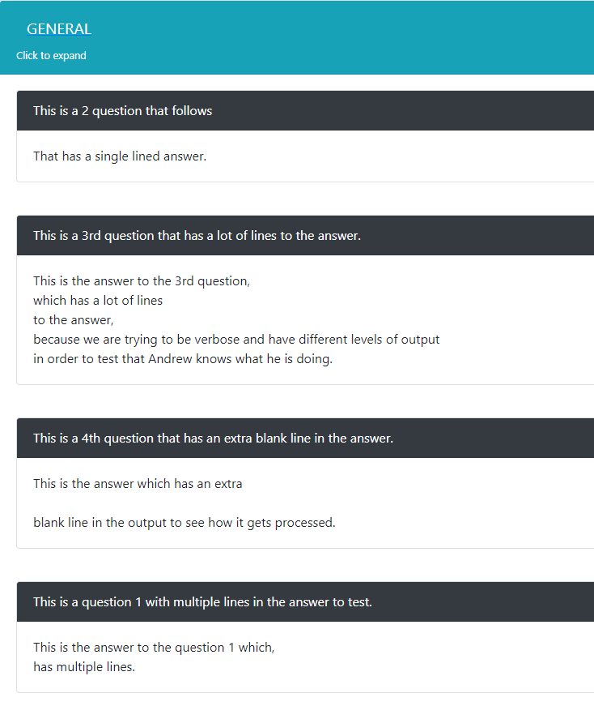

# Add FAQs
Here you will find forms to add and delete FAQs that are displayed on the /nas/faqs page. 

## Add individually
You can add FAQs to a category one at a time. Simply select the category, Set the question and answer portion and click submit.

!!!info
    Content for the answer can contain new lines and even blank lines between sentences if paragraph format is needed.

## Add via an Uploaded File
You can add multiple FAQs at a time via the "Upload File" function. The file must follow a specific set of format and encoding rules as follows:

* The file must be saved in ==.txt== format and must be ==UTF-8== or ==UTF-8-BOM== encoded.

* The keywords ==**question**== and ==**answer**== followed by an ==**:**== must precede the content.
    *  Variations of the keywords that can be used are:
        * Question
        * QUESTION
        * Answer
        * ANSWER
* The *Question* portion can not span multiple new lines(i.e. "enter") and so must be contained all on one line.
* Content for an *Answer* can span multiple new lines and even contain empty lines as so to be able to write answers in paragraph format if needed.

## Upload File Example

??? example
    upload_example.txt
    ```
    question:This is a question 1 with multiple lines in the answer to test.
    answer:This is the answer to the question 1 which,
    has multiple lines.
    question:This is a 2 question that follows
    answer:That has a single lined answer.
    question:This is a 3rd question that has a lot of lines to the answer.
    answer:This is the answer to the 3rd question,
    which has a lot of lines
    to the answer,
    because we are trying to be verbose and have different levels of output
    in order to test that Andrew knows what he is doing.
    question:This is a 4th question that has an extra blank line in the answer.
    Answer:This is the answer which has an extra
    
    blank line in the output to see how it gets processed.
    question:This is the 5th question that contains a keyword in the answer.
    answer:This is the answer for the 5th question which has the keyword
    question: in it.
    ```
    
    
## Delete FAQs
Here you can expand a category to see all the *Question* portions of the FAQ listed with a checkbox next to each one. Select the ones you wish to have deleted across any category and click delete. You can also **<span style="color:red">delete all</span>** the FAQs in a category if needed.